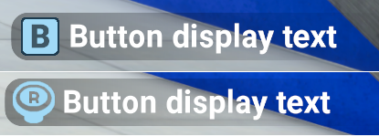

# CustomButtonHints

- Adds custom buttons to the in-game ButtonWindow UI

| Compatibility           | Platform  | Tested game version |
| ----------------------- | --------- | ------------------- |
| Megastore Simulator     | Steam     | v0.2.1             |

## Installation

Just follow these 3 easy steps:

1. If you haven't already, install Tobey's BepInEx Pack for Megastore Simulator - make sure to read the Quick Start for easy instructions:
    - [Tobey's BepInEx Megastore Simulator Git](https://github.com/toebeann/BepInEx.MegastoreSimulator#quick-start) or [Nexus page](https://www.nexusmods.com/megastoresimulator/mods/2)
2. Download the latest release of from the [releases page](https://github.com/FluffyNinjaKitty/CustomButtonHints/releases).
3. Extract the `BepInEx` folder from the downloaded zip file into your game folder - Just drag the `BepInEx` folder out into your game folder

## How to use for your mods

### First off, make sure you set this mod's file as a dependency
 - Add my `CustomButtonHints.dll` as a project dependency to your project
 - You will need to add this either of these lines at the start of your mod's main Plugin.cs script
```cs
[BepInDependency("CustomButtonHints", BepInDependency.DependencyFlags.SoftDependency)]

[BepInDependency("CustomButtonHints", BepInDependency.DependencyFlags.HardDependency)]
```
Depending on if your mod absolutely needs it or not, or if you'd like to add your own warning if it isn't installed

Right below your plugin info, like this
```cs
    [BepInPlugin(MyPluginInfo.PLUGIN_GUID, MyPluginInfo.PLUGIN_NAME, MyPluginInfo.PLUGIN_VERSION)]
    [BepInDependency("CustomButtonHints", BepInDependency.DependencyFlags.SoftDependency)]
```


### Second, the functions that will be available to you:
```cs
public static void AddCustomAction(string actionName, string actionText, KeyCode keyCode) //Adds a custom action for use
public static void AddButtonToUI(string actionName, List<string> existingButtons, Action functionCall, bool exactMatch = true) //Adds a custom action to the UI matching the given list of existing buttons
public static void AddButtonToUI(string actionName, Action functionCall) //Forcefully adds a custom button to the UI
public static void RemoveButtonFromUI(string actionName) //Makes sure a custom button is not added on the next redraw of the UI
public static void OpenButtonWindow() //Forcefully opens the ButtonWindow, useful if you want it to be manually opened and not just if the game is opening it
public static void CloseButtonWindow() //Forcefully closes the ButtonWindow, careful with this one. It can cause softlocks if used incorrectly
```

### Adding your actions to the game
You need to start by using the `AddCustomAction` function first. Without that you won't be able to add them to the UI

Example:
```cs
AddCustomAction("myaction_name", "Button display text", KeyCode.B);
```
This will add an action using the KeyCode `B` with the name `myaction_name` and will display `Button display text`

When added to the UI, will look like this:



### How to add them to the UI, and make them do something
> [!NOTE]
> It is completely YOUR responsibility to make sure you are adding and removing buttons properly


## Need help?

You can use the following links to ask for help:
 - [Modded Megastore Simulator Discord](https://discord.gg/9KrRZx7akG)
 - [Nexus Mods page](https://www.nexusmods.com/megastoresimulator/mods/)
